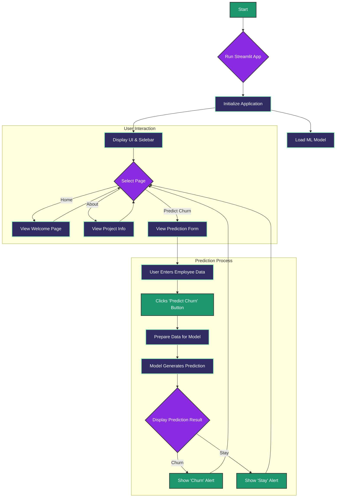

# HR-Employee-Contribution-Model

live link: 

```mermaid
graph TD
    %% Define styles for different node types
    classDef startEnd fill:#1D976C,color:#fff,stroke:#333,stroke-width:2px;
    classDef process fill:#302b63,color:#fff,stroke:#93F9B9,stroke-width:2px;
    classDef decision fill:#8a2be2,color:#fff,stroke:#333,stroke-width:2px;

    A[Start] --> B{Run Streamlit App};
    B --> C[Initialize Application];
    C --> D[Load ML Model];
    C --> E[Display UI & Sidebar];

    subgraph User Interaction
        E --> F{Select Page};
        F -- Home --> G[View Welcome Page];
        F -- About --> H[View Project Info];
        F -- Predict Churn --> I[View Prediction Form];
    end

    subgraph Prediction Process
        I --> J[User Enters Employee Data];
        J --> K[Clicks 'Predict Churn' Button];
        K --> L[Prepare Data for Model];
        L --> M[Model Generates Prediction];
        M --> N{Display Prediction Result};
        N -- Churn --> O[Show 'Churn' Alert];
        N -- Stay --> P[Show 'Stay' Alert];
    end

    %% Apply styles
    class A,K,O,P startEnd;
    class C,D,E,G,H,I,J,L,M process;
    class B,F,N decision;

    %% Link back to page selection
    G --> F;
    H --> F;
    O --> F;
    P --> F;

```
